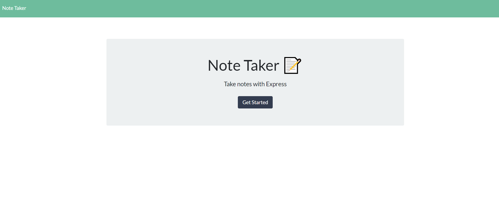
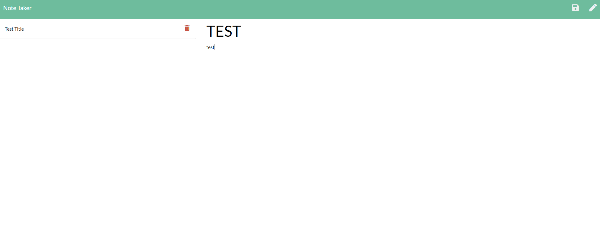

# Notes-Notes-Notes
Note taker, that, takes notes

github: https://github.com/PrLamkin/Notes-Notes-Notes
deployed application: https://note-taker-uwu.herokuapp.com/

Welcome to this weeks, "how does this shit work?"

Step 1. Go ahead and go to the app.

Step 2. get into the meat of the app, and start typing away.

Step 3. at the top right, you have the option ot save by clicking the floppy disk, after that you can press the pencil icon to make a new note.

Step 4. Profit?????

Installation instructions: N/A

Credits: I would love to thank all the beautiful people on good, and the people that made blue light glasses so that I can stare at my screen for long peroids of time without having to leave.

License info: The unlicense license